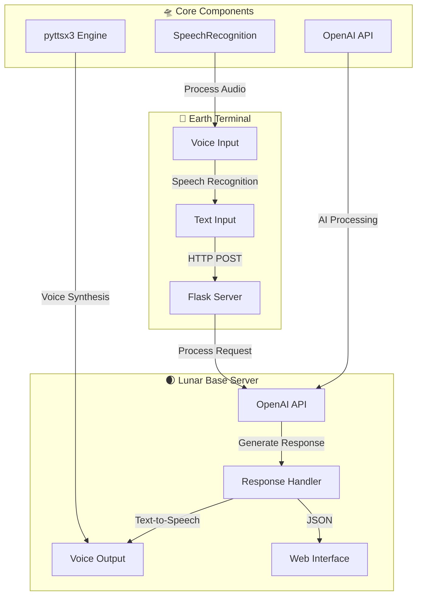

```ascii
  🌒 LUNAR VOICE ASSISTANT 🌒
     .-""""""-.
   .'          '.
  /   O      O   \
 :           `    :
 |                |
 :    .------.    :
  \  '        '  /
   '.          .'
     '-......-'
```

# 🛸 Lunar Voice Assistant

## 👾 Overview
Lunar Voice Assistant is a space-themed AI assistant that combines OpenAI's powerful language model with speech recognition and synthesis capabilities. Operating from our virtual lunar base, it processes Earth transmissions (voice/text) and responds with synthesized voice output.

## 🚀 Features
- Voice recognition for hands-free operation
- Text-to-speech response synthesis
- OpenAI integration for intelligent responses
- Space-themed web interface
- Real-time communication
- Ambient noise adjustment
- Error handling and recovery

## 🛠️ Prerequisites
```
python >= 3.7
openai
pyttsx3
SpeechRecognition
python-dotenv
flask
```

## 🌍 Environment Setup
1. Create a `.env` file in the project root:
```env
OPENAI_API_KEY=your_openai_api_key_here
```

## 🌌 Installation
```bash
# Clone the repository
git clone https://github.com/bniladridas/lunar-echo.git

# Navigate to project directory
cd lunar-echo

# Install dependencies
pip install -r requirements.txt
```

## 🎮 Usage
```bash
# Start the Flask server
python app.py

# Access the interface
Open http://localhost:5000 in your browser
```

## 🧬 System Architecture



### 1. Speech Recognition (`sr`)
- Handles voice input processing
- Adjusts for ambient noise
- Converts speech to text
- Error handling for unrecognized input

### 2. Text-to-Speech Engine (`pyttsx3`)
- Converts text responses to speech
- Manages speech queue
- Handles voice synthesis
- Controls speech properties

### 3. OpenAI Integration
- Processes text input
- Generates intelligent responses
- Temperature control for response variety
- Token limit management

### 4. Flask Server
- Hosts web interface
- Handles HTTP requests
- Manages API endpoints
- Serves static content

## 🎯 API Endpoints

### GET `/`
- Serves the main web interface
- Returns: HTML page

### POST `/send`
- Processes user input
- Parameters: `user_query` (string)
- Returns: JSON response with assistant's reply

## ⚠️ Error Handling
1. Speech Recognition Errors
   - UnknownValueError: Prompts for input repetition
   - RequestError: Reports service issues

2. OpenAI API Errors
   - Connection issues
   - API limits
   - Invalid responses

3. Text-to-Speech Errors
   - Engine initialization
   - Speech synthesis failures

## 🔄 Flow Control
1. User initiates interaction (voice/text)
2. System processes input
3. OpenAI generates response
4. System synthesizes voice output
5. Response displayed in UI

## 🤝 Contributing
Contributions are welcome! Please feel free to submit a Pull Request.

## 📝 License
This project is licensed under the MIT License - see the LICENSE file for details.

## 🌟 Acknowledgments
- OpenAI for the powerful language model
- Flask community for the web framework
- Speech recognition and synthesis libraries maintainers

```ascii
     .    .     .            +     .     .     .
  .    .    .     .    .      .   .     .      .
     .    .    .  +   .    .      .    .    .
  .     .    .     .    .    .      .   .    .
     .    .    .    .     .    .      .    .
  .     .   .    .    .    .     .    .      .
     .     .    .    .      .   .     .     .
        *             .            .          .
             .            .              .
```